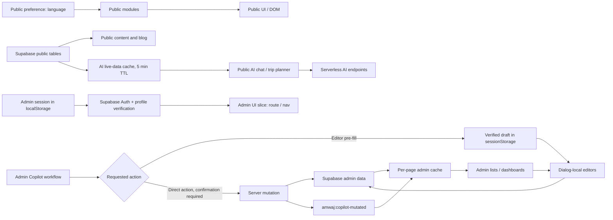

# AMWAJ State Inventory and State Map

**Scope.** This inventory records the live state boundaries found in the AMWAJ Vanilla JavaScript codebase. It distinguishes UI-local data from shared browser preferences, server-derived data, and AI workflow data. Supabase and serverless APIs remain the authoritative sources for persisted content, permissions, pricing, and AI execution.

| Domain | Current owner | State classification | Persistence / source of truth | Audit finding | Target boundary |
|---|---|---|---|---|---|
| Public language and direction | `js/i18n.js`; duplicated by `js/blog.js` | Shared client preference | `localStorage.lang`, `<html lang dir>` | Two imperative writers can set language and document metadata independently. | One small browser preference module, with a language-change event for consumers. |
| Public content cards | `js/public-content.js` | Server state + render-local state | Supabase published tables; server-rendered HTML fallback | No client store is required; each section fetches once and replaces its own grid. | Keep data server-driven and local to the hydration module. |
| Booking / live offers search | `js/booking-engine.js` | Form-local and request-local | Search endpoint / Supabase-backed public data | Submit button state is scoped to the form and released in `finally`. | Keep local; do not globalize form values or async status. |
| Customer reviews | `js/customer-reviews.js` | Form-local, server state, limited UI persistence | Supabase; one-minute local cooldown | State is appropriately isolated to the review widget. | Keep local and server-driven. |
| Public blog | `js/blog.js` | Module-local server state + shared language dependency | Supabase published blog tables | `posts` and `categories` only serve one page; language code duplicates the shared concern. | Retain local blog state; consume shared language preference. |
| Public AI conversation | `js/ai-agent.js` | AI workflow state | In-memory browser history; `/api/chat`; live Supabase context | Conversation is exposed through `window.aiConversationHistory`; UI busy state is only implicit in disabled controls. | Encapsulate history and lifecycle in an AI module; retain live data cache as server-data cache. |
| Public AI live travel data | `js/ai-agent.js` | Server state cache | Supabase public data with five-minute TTL | Cache is bounded and exists to contextualize AI requests, not to replace Supabase. | Keep module-local with explicit `invalidate` / force-refresh capability. |
| Trip Planner | `js/ai-agent.js` | Form-local and request-local AI state | `/api/trip-planner` plus request-scoped live context | Button disable/enable is correctly local; force refresh ensures current business context. | Keep local, retain force-refresh semantics. |
| Admin authentication | `admin/js/supabase-client.js`, `admin/js/admin-app.js` | Shared admin session state | `localStorage` session; Supabase Auth and profiles/RLS | Session is deliberately persisted and verified server-side through `requireAdmin()`. | Keep separate from public state; do not treat client state as authorization. |
| Admin route and navigation | `admin/js/admin-app.js` | Shared admin UI state | URL path/query plus current DOM | `page` and compact-nav behavior are admin-only, but live in one broad state bag. | Move into a compact admin UI slice. |
| Admin collection data | `admin/js/admin-app.js` | Server state cache | Supabase REST via `AmwajAdminClient` | Page renders re-fetch relevant rows and replace cached slices. | Keep per-page cache only; add explicit invalidation after mutations. |
| Admin search / filters | `admin/js/admin-app.js` | Page-local derived state | Input values and current rows | Current `search` is tied to the rendered page. | Keep local to the active renderer; avoid a global filter store. |
| Admin editors | `admin/js/admin-app.js` | Dialog-local form state | Form controls; mutation sent to Supabase only on save | Draft forms, dirty indication, image previews, and object URL cleanup are already local and safe. | Preserve exactly as local editor state. |
| Admin Copilot UI | `admin/js/admin-copilot.js` | Admin AI workflow state | In-memory UI state; limited `sessionStorage` handoff | Drawer state, busy status, history, attachments, and pending mutation are isolated from general admin state. | Keep independent; formalize explicit lifecycle status. |
| AI editor pre-fill | `admin/js/admin-copilot.js` → `admin/js/admin-app.js` | Cross-page handoff state | `sessionStorage` under `amwaj_admin_copilot_editor_prefill` | Verified draft is filtered against allowed fields, opens an editor, and never auto-saves. | Preserve storage key and flow; centralize consume/clear semantics. |
| AI direct actions | `admin/js/admin-copilot.js` | Confirmed mutation workflow | Admin serverless endpoint and Supabase | Direct mutations are confirmation-gated and signal `amwaj:copilot-mutated` for server-data refresh. | Preserve as a separate workflow from editor pre-fill. |
| Admin notifications | `admin/js/admin-app.js` | Ephemeral UI state | DOM only | Toasts have no cross-page persistence requirement. | Keep DOM-local. |

## State Flow Map

## Lifecycle Definitions

| Workflow | Required lifecycle | Current evidence | Guardrail |
|---|---|---|---|
| Public AI chat | `idle → loading → streaming → success | error → idle` | The UI disables the send button and streams into a temporary assistant message. | Only one active send should be permitted; history must be bounded. |
| Public Trip Planner | `idle → loading → success | error → idle` | The planner disables its own button, renders a loading message, then renders result or fallback. | Never promote its form values or result into global public state. |
| Admin Copilot pre-fill | `idle → loading → draft-ready → editor-review → saved/published or discarded` | `editorPrefills` map and session-storage handoff already preserve human review. | No automatic persistence to Supabase. |
| Admin Copilot direct action | `idle → loading → proposed → confirmed → executing → verified | error` | Existing pending mutation and post-mutation refresh event separate this from pre-fill. | Confirmation and server verification remain mandatory. |
| Admin editor | `clean → dirty → saving → saved | error → clean` | Dialog-local dirty indicator, disabled save control, form validation, and URL cleanup exist. | Do not lift fields into a global store. |

## Audit Constraints Confirmed

The codebase is plain HTML/CSS/Vanilla JavaScript, with Supabase REST/Auth and Vercel serverless endpoints. It does not require a client framework migration, a Supabase schema change, or an RLS change. The audit found no active dynamic imports in the public/admin JavaScript footprint and no evidence that an external client-state library is required to express the identified boundaries.

The required implementation should therefore introduce only small native ES modules: one shared preference boundary for public language behavior, one small admin state/cache boundary, and one explicitly scoped AI state helper. Existing local editor, booking, review, and planner forms remain local. Server records remain in Supabase/API and are only cached for the current page or bounded AI-context use.

## Evidence Files

| Area | Source files |
|---|---|
| Public app and booking | `js/app.js`, `js/booking-engine.js`, `js/public-content.js`, `js/customer-reviews.js` |
| Public AI | `js/ai-agent.js` |
| Public blog and language | `js/blog.js`, `js/i18n.js` |
| Admin application | `admin/js/admin-app.js`, `admin/js/admin-copilot.js`, `admin/js/supabase-client.js` |
| Baseline measurements | `docs/state-audit-raw-metrics.md` |

## References

[1]: ./state-audit-raw-metrics.md "Raw audit metrics"
[2]: ../js/ai-agent.js "Public AI client"
[3]: ../admin/js/admin-app.js "Admin application"
[4]: ../admin/js/admin-copilot.js "Admin Copilot"
[5]: ../admin/js/supabase-client.js "Admin Supabase client"
[6]: ../js/public-content.js "Public content hydration"
[7]: ../js/blog.js "Public blog module"
[8]: ../js/i18n.js "Public language module"
